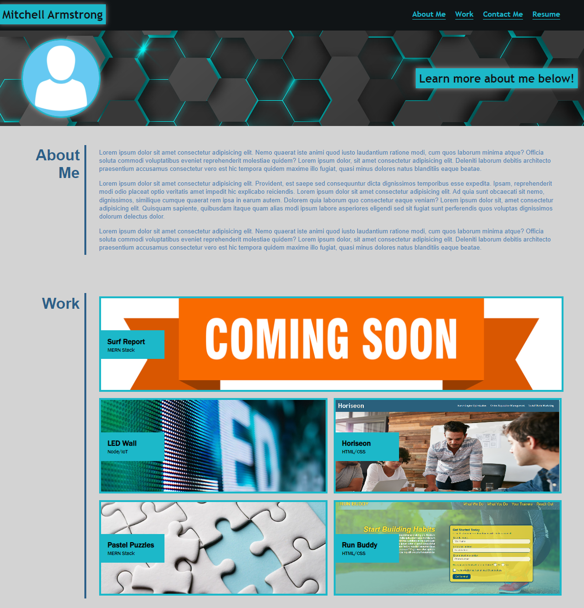

# Professional Portfolio

## About The Project
This website serves as my professional portfolio for interested employers.
In this portfolio you will find a section with some information about me, a section about my work experience that displays the projects I've worked on and what code I used, as well as a contact section at the bottom of the page that have links you can click on to either reach out to me or to look at my GitHub profile or my personal website. Each project in the work section is interactive and can be clicked on to take you to the project it's displaying.

## Important!
There are a few links that, when hovered over, won't allow you to click and will give you a "not-allowed" cursor. This is because these links are supposed to take you to something that is currently a work in progress and therefore are not linked and is why I don't want the user to click on the link expecting it to take them somewhere.

## Built with:
* HTML
* CSS

### Go to the website by clicking the link below!
https://scarelite.github.io/professional-portfolio/

## Here's a preview of the website!

## Contribution:
Made by Mitchell Armstrong

## Contact
Mitchell Armstrong - email@example.com

Project Link: https://github.com/ScarElite/professional-portfolio